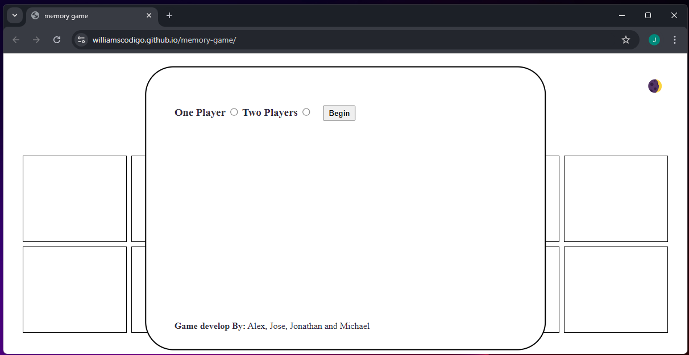
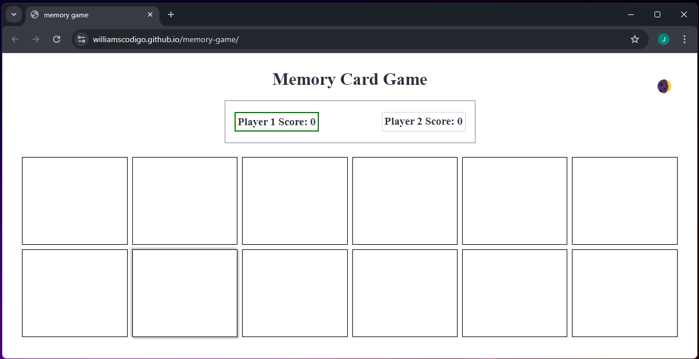
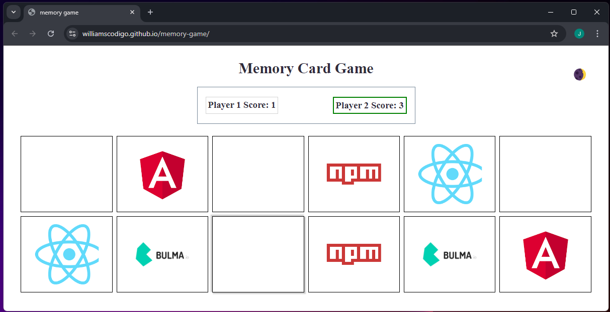
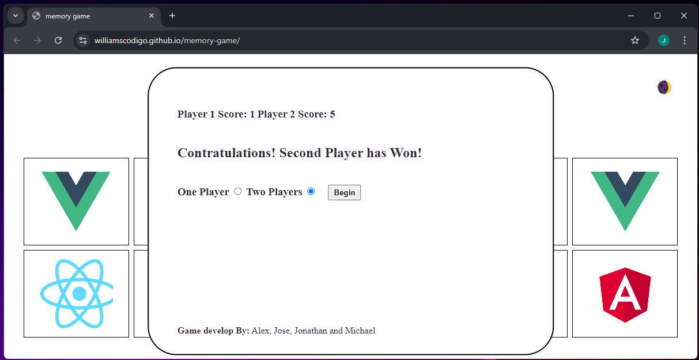

# Memory Card Game

## Description

This front-end development project, is a Memory Card Game, in which you and your oponent can take turns flipping cards revealing its content, each card content is duplicated exactly once which mean each card have a pair, the purpose of the game is to reveal a card following by its pair, if a pair is find that players keeps its turn and continue trying to find more pairs, if no pair is found it becomes the oponents turn. Game ends when all pairs have been found and the player with more pairs win the game.

We all deserve a break from our daily obligations and routines, as a web developer student and seen how other students also struggle with hw/activities/challenges/studying my team and I desided to create the game with web development technologies logo/icons, that way students can not only enjoy a simple memory game but also learn while playing it.

Everyone in my team including myself are new to the world of web development in particular to working with others, collaboration is one of the biggest challenges we came accross during this project because we all have different experiences, coding styles, project vision, time constraints, etc. At the end we all learned a little bit more about what colaboration is and why its important in web develoment and other software development projects.

## Installation

This game is live on Github Pages and you can play it here: [https://williamscodigo.github.io/memory-game/](https://williamscodigo.github.io/memory-game/).

## Usage

To play the game visit the page above on your browser.

1. When you lang on the page you are greeted with a modal with options to select one or two players mode, once a mode is selected you can click begin button to start the game.

2. First players turn is decided randomly

3. Play game until all card pairs have been reveal

4. Winners message is display and you have the option to play again

## Credits

Jaime Argila, aka Alex/Zen: [https://github.com/ZenbladeJS](https://github.com/ZenbladeJS).

Jose W. Rivas: [https://github.com/williamscodigo](https://github.com/williamscodigo).

Jonathan Hegarty: [https://github.com/HeresJonny117](https://github.com/HeresJonny117).

Michael Joshua: [https://github.com/olescom](https://github.com/olescom).

## License

The MIT License

Permission is hereby granted, free of charge, to any person obtaining a copy of this software and associated documentation files (the "Software"), to deal in the Software without restriction, including without limitation the rights to use, copy, modify, merge, publish, distribute, sublicense, and/or sell copies of the Software, and to permit persons to whom the Software is furnished to do so, subject to the following conditions:

The above copyright notice and this permission notice shall be included in all copies or substantial portions of the Software.

THE SOFTWARE IS PROVIDED "AS IS", WITHOUT WARRANTY OF ANY KIND, EXPRESS OR IMPLIED, INCLUDING BUT NOT LIMITED TO THE WARRANTIES OF MERCHANTABILITY, FITNESS FOR A PARTICULAR PURPOSE AND NONINFRINGEMENT. IN NO EVENT SHALL THE AUTHORS OR COPYRIGHT HOLDERS BE LIABLE FOR ANY CLAIM, DAMAGES OR OTHER LIABILITY, WHETHER IN AN ACTION OF CONTRACT, TORT OR OTHERWISE, ARISING FROM, OUT OF OR IN CONNECTION WITH THE SOFTWARE OR THE USE OR OTHER DEALINGS IN THE SOFTWARE.